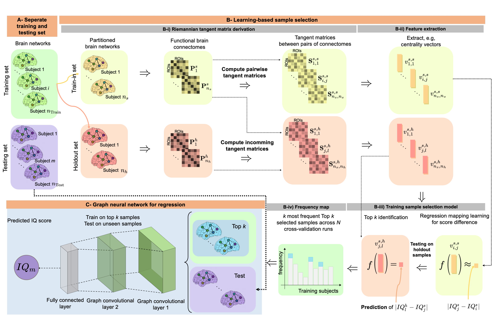

# RegGNN
RegGNN, a graph neural network architecture for many-to-one regression tasks with application to functional brain connectomes for IQ score prediction, developed in Python by Mehmet Arif Demirtaş (demirtasm18@itu.edu.tr). [*This work has been published in Brain Imaging and Behavior.*](https://link.springer.com/article/10.1007/s11682-021-00585-7)

This repository contains the implementation for the proposed RegGNN model and learning-based sample selection, and the codes for the comparison models from the following paper:



> **Predicting cognitive scores with graph neural networks through sample selection learning**
>
> [Martin Hanik](mailto:hanik@zib.de)<sup>†1</sup>, [Mehmet Arif Demirtaş](https://github.com/marifdemirtas)<sup>†2</sup>, [Mohammed Amine Gharsallaoui]()<sup>2, 3</sup>, [Islem Rekik](https://basira-lab.com/)<sup>2</sup><br/>
> <sup>1</sup>Zuse Institute Berlin, Berlin, Germany<br/>
> <sup>2</sup>BASIRA Lab, Faculty of Computer and Informatics, Istanbul Technical University, Istanbul, Turkey<br/>
> <sup>3</sup>Ecole Polytechnique de Tunisie (EPT), Tunis, Tunisia<br/>
> <sup>†</sup>Equal Contribution<br/>
>
> **Abstract:** *Analyzing the relation between intelligence and neural activity is of the utmost importance in understanding the working principles of the human brain in health and disease. In existing literature, functional brain connectomes have been used successfully to predict cognitive measures such as intelligence quotient (IQ) scores in both healthy and disordered cohorts using machine learning models. However, existing methods resort to flattening the brain connectome (i.e., graph) through vectorization which overlooks its topological properties. To address this limitation and inspired from the emerging graph neural networks (GNNs), we design a novel regression GNN model (namely RegGNN) for predicting IQ scores from brain connectivity. On top of that, we introduce a novel, fully modular sample selection method to select the best samples to learn from for our target prediction task. However, since such deep learning architectures are computationally expensive to train, we further propose a __learning-based sample selection__ method that learns how to choose the training samples with the highest expected predictive power on unseen samples. For this, we capitalize on the fact that connectomes (i.e., their adjacency matrices) lie in the symmetric positive definite (SPD) matrix cone. Our results on full-scale and verbal IQ prediction outperforms comparison methods in autism spectrum disorder cohorts and achieves a competitive performance for neurotypical subjects using 3-fold cross-validation. Furthermore, we show that our sample selection approach generalizes to other learning-based methods, which shows its usefulness beyond our GNN architecture.*

## Credits

 - Code for RegGNN and sample selection methods is written by [Mehmet Arif Demirtaş](https://web.itu.edu.tr/demirtasm18/).
 - Code for CPM model is written by [esfinn](https://github.com/esfinn), our functions are taken [from this notebook](https://github.com/esfinn/cpm_tutorial/blob/master/cpm_tutorial.ipynb).
 - Code for PNA model is written by [lukecavabarrett](https://github.com/lukecavabarrett/), [available in this repository](https://github.com/lukecavabarrett/pna).
 - Code for SPD, geometric processing tool, is developed within the geometric data analysis and processing research group at Zuse Institute Berlin and is available at [Morphomatics](https://morphomatics.github.io/).


## Dependencies

Code for RegGNN was prepared using Python 3.7.10. The major dependencies are listed below, and the full list can be found in ```requirements.txt```:

* torch >= 1.7.0
* torch_scatter >= 2.0.6
* torch_sparse >= 0.6.9
* torch_cluster >= 1.5.9
* torch_spline_conv >= 1.2.1
* torch_geometric >= 1.6.3
* scikit-learn >= 0.24.1
* pymanopt >= 0.2.5
* numpy >= 1.19.5
* pandas >= 1.1.5
* scipy >= 1.5.4

Most packages can be installed using ```pip install -r requirements.txt``` command, whereas torch_scatter, torch_sparse, torch_cluster and torch_spline_conv can be installed from using the following commands, as they are not available on PyPI:

```
pip install torch-scatter -f https://pytorch-geometric.com/whl/torch-1.7.0+cu102.html
pip install torch-sparse -f https://pytorch-geometric.com/whl/torch-1.7.0+cu102.html
pip install torch-cluster -f https://pytorch-geometric.com/whl/torch-1.7.0+cu102.html
pip install torch-spline-conv -f https://pytorch-geometric.com/whl/torch-1.7.0+cu102.html
```

Detailed information on torch_geometric installation can be found on [their website](https://pytorch-geometric.readthedocs.io/en/latest/notes/installation.html).

## Download the ABIDE functional connectome data

You can directly download the functional connectomes at: http://fcon_1000.projects.nitrc.org/fcpClassic/FcpTable.html

## Preparing Data for RegGNN

```demo.py``` file can be used to either prepare real data for usage in RegGNN by extracting topological features, or it can be used to create simulated data and topological features using the parameters specified in ```config.py``` file.

To simulate functional brain connectome data and create topological features using eigenvector centrality measure, use the following command:

```bash
python demo.py --mode data --data-source simulated --selector eigen
```

To extract topological features using node degree centrality measure from existing data, use the following command:

```bash
python demo.py --mode data --data-source saved --selector node
```

All valid values for measures are:
- ```abs```: Absolute values between connectomes
- ```geo```: Scalar Riemannian distance value 
- ```tan```: Featurized tangent matrix
- ```eigen```: Eigenvector centrality
- ```node```: Node degree centrality
- ```close```: Closeness centrality
- ```concat_orig```: Concatenated centralities (not scaled)
- ```concat_scale```: Concatenated centralities (min-max scaled)

## Using RegGNN on Prepared Data

```demo.py``` file can also be used to apply cross-validation on prepared data using the preprocess commands above, using the parameters specified in ```config.py``` file. In addition to our proposed RegGNN model, other comparison models used in the paper, CPM and PNA are also supported.

To use RegGNN model and sample selection to make inferences on data:

```bash
python demo.py --mode infer --model RegGNN
```

## Configuration Options

Different options for models and data can be specified using ```config.py``` file. The options used throughout the program are as follows:

System options:
- ```DATA_FOLDER```: path to the folder data will be written to and read from
- ```RESULT_FOLDER```: path to the folder data will be written to and read from

Simulated data options:
- ```CONNECTOME_MEAN```: mean of the distribution from which connectomes will be sampled
- ```CONNECTOME_STD```: std of the distribution from which connectomes will be sampled
- ```SCORE_MEAN```: mean of the distribution from which scores will be sampled
- ```SCORE_STD```: std of the distribution from which scores will be sampled
- ```N_SUBJECTS```: number of subjects in the simulated data
- ```ROI```: number of regions of interest in brain graph
- ```SPD```: whether or not to make generated matrices symmetric positive definite

Evaluation options:
- ```K_FOLDS```: number of cross validation folds

RegGNN options:
- ```NUM_EPOCH```: number of epochs the process will be run for
- ```LR```: learning rate
- ```WD```: weight decay
- ```DROPOUT```: dropout rate

PNA options:
- ```NUM_EPOCH```: number of epochs the process will be run for
- ```LR```: learning rate
- ```WD```: weight decay
- ```DROPOUT```: dropout rate
- ```SCALERS```: scalers used by PNA
- ```AGGRS```: aggregators used by PNA

Sample selection options:
- ```SAMPLE_SELECTION```: whether or not to apply sample selection
- ```K_LIST```: list of k values for sample selection
- ```N_SELECT_SPLITS```: number of folds for the nested sample selection cross validation

Randomization options:
- ```DATA_SEED```: random seed for data creation
- ```MODEL_SEED```: random seed for models
- ```SHUFFLE```: whether to shuffle or not

<!-- # YouTube videos to install and run RegGNN
{video_info}
-->

# Please cite the following paper when using RegGNN:

```latex
@article{hanik2022predicting, 
         title={Predicting cognitive scores with graph neural networks through sample selection learning},
         volume={16},
         ISSN={1931-7557, 1931-7565},
         url={https://link.springer.com/10.1007/s11682-021-00585-7},
         DOI={10.1007/s11682-021-00585-7},
         number={3},
         journal={Brain Imaging and Behavior},
         author={Hanik, Martin and Demirtaş, Mehmet Arif and Gharsallaoui, Mohammed Amine and Rekik, Islem},
         year={2022},
         month={Jun},
         pages={1123–1138},
         language={en}
}
```

# RegGNN on arXiv 

Link: https://arxiv.org/abs/2106.09408

# License

Our code is released under MIT License (see LICENSE file for details).
